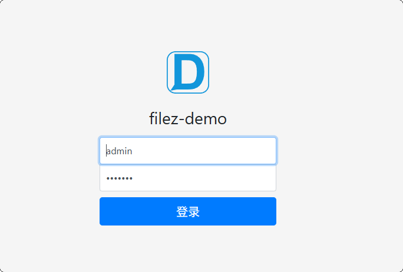

# Filez Demo Java - 文档管理集成示例项目

## 项目简介

Filez Demo Java 是一个基于 Spring Boot 的文档管理集成示例项目，面向需要快速对接文档中台/文档服务的业务系统。

项目内置标准化的文档上传、下载、删除、元信息维护接口，并集成了用户认证与权限校验机制，覆盖文档管理的核心通用能力。

在前端层面，项目已预留文档列表、预览、编辑等页面入口与菜单结构，开发者只需实现具体的文档预览与编辑业务逻辑，即可快速完成与文档中台类产品的集成，显著降低接入成本。

<div style="color:red">如果需要支持多人协同编辑，必须使用项目内置的模板文件进行测试，个人上传的文件只会出现在个人的仓库列表，无法共享</div>

## 项目截图
- 登录界面：
会默认填充，也可以切换为其他账号，可跳转至<span style="color:red">dml.sql</span>文件查看内置的所有用户


- 登录成功后，进入主页：

点击文件名会打开新标签页进行预览，点击编辑按钮会打开新标签页进行编辑，最右侧的更多按钮点击会出现下拉菜单，支持在当前标签页进行编辑或预览，并支持查看、编辑文件的元信息


- 当前的预览、编辑逻辑已移除，需要自行实现


## 核心功能

- 🔐 用户认证功能

<span style="color:red">所有接口均需进行鉴权，支持修改当前用户的基础信息</span>

- 📁 文档管理功能

<span style="color:red">内置初始模板文件，支持文件上传下载、并查看编辑文件的元信息</span>

## 技术架构

### 后端技术栈
- **框架**: Spring Boot 2.5.4
- **数据库**: SQLite (内嵌数据库，无需额外安装)
- **ORM**: MyBatis Plus 3.4.3.4
- **模板引擎**: FreeMarker
- **JSON处理**: Fastjson 1.2.83
- **JWT**: JJWT 0.9.1
- **HTTP客户端**: Apache HttpClient 4.5.13

### 项目结构
```
filez-demo/
├── src/main/java/com/filez/demo/
│   ├── common/                # 公共组件
│   │   ├── aspect/            # AOP切面 (日志记录)
│   │   ├── context/           # 上下文管理 (用户上下文)
│   │   ├── interceptor/       # 拦截器 (登录拦截)
│   │   ├── listener/          # 监听器
│   │   └── utils/             # 工具类 (JWT、HMAC等)
│   ├── config/                # 配置类
│   │   ├── DatabaseConfig.java    # 数据库配置
│   │   ├── DemoConfig.java        # 业务配置
│   │   ├── SwaggerConfig.java     # API文档配置
│   ├── controller/            # 控制器层
│   │   ├── LoginController.java   # 登录控制器
│   │   ├── HomeController.java    # 主页控制器
│   │   ├── FileController.java    # 文件操作控制器
│   ├── dao/                   # 数据访问层
│   ├── entity/                # 实体类
│   ├── model/                 # 数据模型
│   ├── service/               # 业务逻辑层
│   └── FilezDemoApplication.java  # 启动类
├── src/main/resources/
│   ├── application.yml       # 主配置文件
│   ├── mapper/               # MyBatis映射文件
│   ├── sql/                  # 数据库脚本
│   ├── static/               # 静态资源
│   └── templates/            # FreeMarker模板
├── data/                     # SQLite数据库文件
├── local-file/              # 本地文件存储
└── logs/                    # 日志文件
```

## 快速开始

### 环境要求
- Java 8 或更高版本

使用下面的命令查看是否安装成功及对应的版本号
```shell
java -version
```
- Maven 3.6 或更高版本

使用下面的命令查看是否安装成功及对应的版本号
```shell
mvn -v
```

### 编译打包
```bash
# 克隆项目
git clone <repository-url>
cd filez-demo

# 编译打包
mvn clean package
```

### 配置说明

项目支持多种配置方式，可根据部署环境选择合适的配置方法：

#### 1. 本地开发调试
找到项目的启动类：`FilezDemoApplication.java`，点击左侧运行按钮即可

项目启动时会自动初始化数据库文件，并初始化用户数据

#### 2. 服务器默认配置

可以在服务器新建 /opt/filez-demo 目录，将打包好的jar包放入此文件夹

然后使用下面的命令启动项目，不过如果是需要集成文档中台，一般需要修改默认配置，所以不太建议此方式
```bash
java -jar filez-demo-1.0.0.RELEASE.jar
```

#### 3. 服务器命令行参数

支持自定义启动参数，如：启动端口、文档中台服务地址等，具体配置项请自行实现
```bash
java -jar filez-demo-1.0.0.RELEASE.jar \
  --server.port=8000 \
  --zoffice.service.host=172.16.34.165 \
  --zoffice.service.port=8001 \
  --demo.host=172.16.34.165
```

#### 4. 服务器外部配置文件 [推荐]

在jar文件的同级目录下 创建 `application-external.yml` 配置文件：

例如：
```yaml
server:
  port: 8000

zoffice:
  service:
    host: 172.16.34.165
    port: 8001

demo:
  host: 172.16.34.165
  context: /v2/context
  repoId: 3rd-party
```

### 启动方式

#### 标准启动 (前台运行)

带配置文件启动
```bash
java -jar ./filez-demo-1.0.0.RELEASE.jar --spring.profiles.active=external
```

#### 后台启动 (推荐生产环境)
```bash
# 使用外部配置文件启动
nohup java -jar ./filez-demo-1.0.0.RELEASE.jar --spring.profiles.active=external &

# 使用命令行参数启动
nohup java -jar ./filez-demo-1.0.0.RELEASE.jar \
  --zoffice.service.host=172.16.34.165 \
  --zoffice.service.port=8001 \
  --demo.host=172.16.34.165 &
```

### 停止服务

#### 1. 查找进程
```bash
# 查看端口占用情况
sudo netstat -tunlp | grep ':8000'

# 或者查看Java进程
ps aux | grep filez-demo
```

#### 2. 停止进程
```bash
# 根据进程ID停止 (推荐方式)
sudo kill 28163

# 强制停止 (谨慎使用)
sudo kill -9 28163

# 停止所有相关进程
pkill -f filez-demo
```

### 访问应用

启动成功后，可通过以下地址访问：

- **主页**: http://localhost:8000

默认登录账号：
- 用户名: `admin`
- 密码: `zOffice`

## API 接口文档

### 认证相关接口
- `GET /login` - 登录页面
- `POST /login` - 用户登录
- `GET /logout` - 用户登出

### 文件管理接口
- `POST /v2/context/file/upload` - 上传文件
- `POST /v2/context/file/batchOp/upload` - 批量上传文件
- `DELETE /v2/context/file/delete/{docId}` - 删除文件
- `POST /v2/context/file/batchOp/delete` - 批量删除文件
- `POST /v2/context/file/new` - 新建文件

### ZOffice 集成接口<span style="color:red">【需要自行实现】</span>
具体实现方案请查阅技术文档：[ZOffice 集成文档](https://api.filez.com/office/docs/docs-api/get-started/overview)

### 日志查看

如果不习惯命令行查看日志，可以直接找到当前目录下的 `logs` 目录下查看日志
```bash
# 查看实时日志
tail -f logs/filezDemo.log

# 查看错误日志
grep -i error logs/filezDemo.log

# 查看最近的日志
tail -n 100 logs/filezDemo.log
```

## 开发指南

### 本地开发环境搭建
1. 安装 Java 8+ 和 Maven 3.6+
2. 克隆项目代码
3. 导入IDE (推荐使用 IntelliJ IDEA)
4. 运行 `FilezDemoApplication.main()` 启动应用

---

**注意**: 本项目是一个集成示例，实际使用时请根据具体业务需求进行相应的修改和优化。
