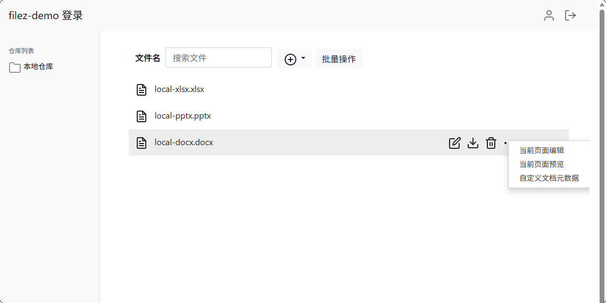

# Filez Demo Java - 文档管理集成示例项目

## 项目简介

Filez Demo Java 是一个基于 Spring Boot 的文档管理集成示例项目，主要用于演示如何与 Filez 文档中台进行集成。项目提供了完整的文档上传、下载、删除接口，用户认证、文件元信息修改等功能。并保留了页面菜单上编辑、预览的功能入口（点击文件名进入预览页面，点击编辑按钮打开编辑页面），用户仅需实现业务逻辑即可，方便快速与Filez文档中台进行集成对接。

## 项目截图



## 核心功能

### 🔐 用户认证系统

### 📁 文档管理功能

### 📝 ZOffice 集成功能

### 🔧 系统管理功能

## 技术架构

### 后端技术栈
- **框架**: Spring Boot 2.5.4
- **数据库**: SQLite (内嵌数据库，无需额外安装)
- **ORM**: MyBatis Plus 3.4.3.4
- **模板引擎**: FreeMarker
- **API文档**: Knife4j (Swagger)
- **JSON处理**: Fastjson 1.2.83
- **JWT**: JJWT 0.9.1
- **HTTP客户端**: Apache HttpClient 4.5.13

### 项目结构
```
filez-demo/
├── src/main/java/com/filez/demo/
│   ├── common/                # 公共组件
│   │   ├── aspect/            # AOP切面 (日志记录)
│   │   ├── context/           # 上下文管理 (用户上下文)
│   │   ├── interceptor/       # 拦截器 (登录拦截)
│   │   ├── listener/          # 监听器
│   │   └── utils/             # 工具类 (JWT、HMAC等)
│   ├── config/                # 配置类
│   │   ├── DatabaseConfig.java    # 数据库配置
│   │   ├── DemoConfig.java        # 业务配置
│   │   ├── SwaggerConfig.java     # API文档配置
│   ├── controller/            # 控制器层
│   │   ├── LoginController.java   # 登录控制器
│   │   ├── HomeController.java    # 主页控制器
│   │   ├── FileController.java    # 文件操作控制器
│   ├── dao/                   # 数据访问层
│   ├── entity/                # 实体类
│   ├── model/                 # 数据模型
│   ├── service/               # 业务逻辑层
│   └── FilezDemoApplication.java  # 启动类
├── src/main/resources/
│   ├── application.yml       # 主配置文件
│   ├── mapper/               # MyBatis映射文件
│   ├── sql/                  # 数据库脚本
│   ├── static/               # 静态资源
│   └── templates/            # FreeMarker模板
├── data/                     # SQLite数据库文件
├── local-file/              # 本地文件存储
└── logs/                    # 日志文件
```

## 快速开始

### 环境要求
- Java 8 或更高版本
- Maven 3.6 或更高版本

### 编译打包
```bash
# 克隆项目
git clone <repository-url>
cd filez-demo

# 编译打包
mvn clean package
```

### 配置说明

项目支持多种配置方式，可根据部署环境选择合适的配置方法：

#### 1. 使用内置配置 (开发环境)
直接使用项目内置的 SQLite 数据库和默认配置：

```bash
java -jar target/filez-demo-1.0.0.RELEASE.jar
```

#### 2. 使用外部配置文件
创建 `application-external.yml` 配置文件：

```yaml
server:
  port: 8000

zoffice:
  service:
    host: 172.16.34.165
    port: 8001

demo:
  host: 172.16.34.165
  context: /v2/context
  repoId: 3rd-party
```

#### 3. 使用命令行参数
```bash
java -jar target/filez-demo-1.0.0.RELEASE.jar \
  --server.port=8000 \
  --zoffice.service.host=172.16.34.165 \
  --zoffice.service.port=8001 \
  --demo.host=172.16.34.165
```

### 启动方式

#### 标准启动 (前台运行)
```bash
java -jar ./filez-demo-1.0.0.RELEASE.jar --spring.profiles.active=external
```

#### 后台启动 (推荐生产环境)
```bash
# 使用外部配置文件启动
nohup java -jar ./filez-demo-1.0.0.RELEASE.jar --spring.profiles.active=external &

# 使用命令行参数启动
nohup java -jar ./filez-demo-1.0.0.RELEASE.jar \
  --zoffice.service.host=172.16.34.165 \
  --zoffice.service.port=8001 \
  --demo.host=172.16.34.165 &
```

### 停止服务

#### 1. 查找进程
```bash
# 查看端口占用情况
sudo netstat -tunlp | grep ':8000'

# 或者查看Java进程
ps aux | grep filez-demo
```

#### 2. 停止进程
```bash
# 根据进程ID停止 (推荐方式)
sudo kill 28163

# 强制停止 (谨慎使用)
sudo kill -9 28163

# 停止所有相关进程
pkill -f filez-demo
```

### 访问应用

启动成功后，可通过以下地址访问：

- **主页**: http://localhost:8000
- **登录页**: http://localhost:8000/login
- **API文档**: http://localhost:8000/doc.html
- **文件管理**: http://localhost:8000/home

默认登录账号：
- 用户名: `admin`
- 密码: `zOffice`

## API 接口文档

### 认证相关接口
- `GET /login` - 登录页面
- `POST /login` - 用户登录
- `GET /logout` - 用户登出

### 文件管理接口
- `POST /v2/context/file/upload` - 上传文件
- `POST /v2/context/file/batchOp/upload` - 批量上传文件
- `DELETE /v2/context/file/delete/{docId}` - 删除文件
- `POST /v2/context/file/batchOp/delete` - 批量删除文件
- `POST /v2/context/file/new` - 新建文件

### ZOffice 集成接口<span style="color:red">【需要自行实现】</span>
具体实现方案请查阅技术文档：[ZOffice 集成文档](https://api.filez.com/office/docs/docs-api/get-started/overview)
- `GET /v2/context/driver-cb` - 获取前端集成URL
- `GET /v2/context/{docId}/content` - 下载文件内容
- `POST /v2/context/{docId}/content` - 上传文件内容
- `GET /v2/context/{docId}/meta` - 获取文档元数据
- `GET /v2/context/profiles` - 获取用户信息
- `POST /v2/context/{docId}/notify` - 文档状态通知
- `POST /v2/context/{docId}/mention` - 文档批注通知
- `GET /v2/context/compareDoc` - 文档对比

### 页面路由
- `GET /home/` - 主页
- `GET /home/local` - 文件列表页
- `GET /home/user` - 用户信息页

### 日志查看
```bash
# 查看实时日志
tail -f logs/filezDemo.log

# 查看错误日志
grep -i error logs/filezDemo.log

# 查看最近的日志
tail -n 100 logs/filezDemo.log
```

## 开发指南

### 本地开发环境搭建
1. 安装 Java 8+ 和 Maven 3.6+
2. 克隆项目代码
3. 导入IDE (推荐使用 IntelliJ IDEA)
4. 运行 `FilezDemoApplication.main()` 启动应用


## 技术支持

如有问题，请通过以下方式联系：
- 提交 Issue
- 发送邮件至技术支持邮箱

---

**注意**: 本项目是一个集成示例，实际使用时请根据具体业务需求进行相应的修改和优化。
